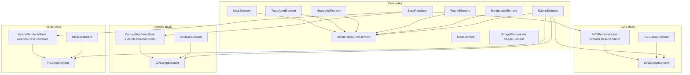

# Prototype / `extendPrototype` inventory and class migration strategy

This document supports Track A (strict typing) and Track B (ES classes) modernization. *Last updated: 2025-03-22 — `CVShapeElement` holds the canvas shape pipeline (`createStyleElement` through `renderStroke`, plus `renderInnerContent`) on the `class`; **`createContent`** and **`destroy`** use save-restore vs **`CVBaseElement`**; only **`initElement`** (from **`RenderableDOMElement`**), **`transformHelper`**, and **`dashResetter`** stay **`prototype`** assignments after **`extendPrototype`**. `CVSolidElement` keeps `renderInnerContent` on the `class`. Compositions: `SVGCompElement`, `CVCompElement`, and `HCompElement` define `createComp` on the `class` (`HCompElement` also `addTo3dContainer`); `CVCompElement` keeps `renderInnerContent` and `destroy` on the `class` (save-restore); `HCompElement` keeps `createContainerElements` on the `class` (save-restore + `_createBaseContainerElements`). `NullElement` uses the same pattern for `sourceRectAtTime` vs `BaseElement`. `HShapeElement` keeps bbox helpers, **`createContent`**, and **`renderInnerContent`** on the **`class`** (save-restore vs **`SVGShapeElement`**); after **`extendPrototype`**, **`_renderShapeFrame`** is set to the mixed-in SVG **`renderInnerContent`**, then HTML **`createContent`** / **`renderInnerContent`** are restored; shared **`shapeBoundingBox`** / **`tempBoundingBox`** stay on **`prototype`**. `SVGShapeElement` keeps the pipeline on the `class`; `renderInnerContent` / `destroy` use save-restore vs `RenderableDOMElement`; `initSecondaryElement` / `buildExpressionInterface` are class methods; `identityMatrix` remains one shared `prototype` matrix after `extendPrototype`. `SVGTextLottieElement` / `HTextElement` use save-restore for text `renderInnerContent` (and SVG text `sourceRectAtTime`). `CVImageElement` uses save-restore for `createContent` / `destroy` vs `CVBaseElement`; `HImageElement` does the same for `createContent` vs `HSolidElement`. Earlier slices: `CVTextElement`, `FootageElement` / `AudioElement` / `ICompElement`, etc.*

Regenerate the call-site table with:

```bash
rg "extendPrototype\(" src --glob '*.ts' -l
```

## How `extendPrototype` works

[`src/utils/functionExtensions.ts`](../../src/utils/functionExtensions.ts) copies **enumerable own properties** from each source constructor’s `prototype` onto the destination’s `prototype`, in **array order**. Later sources overwrite earlier keys on collision—**order matters**.

The worker bundle duplicates the same helper inside [`src/worker_wrapper.ts`](../../src/worker_wrapper.ts) for proxy DOM/canvas types.

## Trait dependency overview (mermaid)



**Note:** Precomposed elements (e.g. `IImageElement`, `SVGShapeElement`, `HSolidElement`) are themselves mixin products; comps and hybrid shapes **stack renderer bases with element traits** (e.g. `SVGCompElement` = `SVGRendererBase` + `ICompElement` + `SVGBaseElement`).

## `extendPrototype` call sites by category

### Animation / events

| Destination        | Mixin chain                         | File                      |
| ------------------ | ----------------------------------- | ------------------------- |
| `AnimationItem`    | `BaseEvent`                         | `animation/AnimationItem.ts` |

### Renderers

| Destination           | Mixin chain                    | File                           |
| --------------------- | ------------------------------ | ------------------------------ |
| `SVGRendererBase`     | `BaseRenderer`                 | `renderers/SVGRendererBase.ts` |
| `SVGRenderer`         | `SVGRendererBase`              | `renderers/SVGRenderer.ts`     |
| `CanvasRendererBase`  | `BaseRenderer`                 | `renderers/CanvasRendererBase.ts` |
| `CanvasRenderer`      | `CanvasRendererBase`           | `renderers/CanvasRenderer.ts`  |
| `HybridRendererBase`  | `BaseRenderer`                 | `renderers/HybridRendererBase.ts` |
| `HybridRenderer`      | `HybridRendererBase`           | `renderers/HybridRenderer.ts`  |

### Composition elements (nested renderer + comp)

| Destination    | Mixin chain                                              | File                               |
| -------------- | -------------------------------------------------------- | ---------------------------------- |
| `SVGCompElement` | `SVGRendererBase`, `ICompElement`, `SVGBaseElement`    | `elements/svgElements/SVGCompElement.ts` |
| `CVCompElement`  | `CanvasRendererBase`, `ICompElement`, `CVBaseElement`   | `elements/canvasElements/CVCompElement.ts` |
| `HCompElement`   | `HybridRendererBase`, `ICompElement`, `HBaseElement`  | `elements/htmlElements/HCompElement.ts` |
| `CVCompBaseElement` | `class extends BaseRenderer` (no `extendPrototype`) | `elements/canvasElements/CVCompBaseElement.ts` |

### Shared / DOM elements

| Destination      | Mixin chain                                                                 | File                         |
| ---------------- | --------------------------------------------------------------------------- | ---------------------------- |
| `ICompElement`   | `BaseElement`, `TransformElement`, `HierarchyElement`, `FrameElement`, `RenderableDOMElement` | `elements/CompElement.ts`    |
| `IImageElement`  | `BaseElement`, `TransformElement`, `SVGBaseElement`, `HierarchyElement`, `FrameElement`, `RenderableDOMElement` | `elements/ImageElement.ts`   |
| `ISolidElement`  | `IImageElement`                                                             | `elements/SolidElement.ts`   |
| `SVGShapeElement` | `BaseElement`, `TransformElement`, `SVGBaseElement`, `IShapeElement`, `HierarchyElement`, `FrameElement`, `RenderableDOMElement` | `elements/svgElements/SVGShapeElement.ts` |
| `SVGTextLottieElement` | `BaseElement`, `TransformElement`, `SVGBaseElement`, `HierarchyElement`, `FrameElement`, `RenderableDOMElement`, `ITextElement` | `elements/svgElements/SVGTextElement.ts` |
| `NullElement`    | `BaseElement`, `TransformElement`, `HierarchyElement`, `FrameElement`      | `elements/NullElement.ts`    |
| `RenderableDOMElement` | `RenderableElement`, dynamic proxy prototype                              | `elements/helpers/RenderableDOMElement.ts` |

### Canvas layer elements

| Destination     | Mixin chain                                                                                       | File                                  |
| --------------- | ------------------------------------------------------------------------------------------------- | ------------------------------------- |
| `CVShapeElement` | `BaseElement`, `TransformElement`, `CVBaseElement`, `IShapeElement`, `HierarchyElement`, `FrameElement`, `RenderableElement` | `elements/canvasElements/CVShapeElement.ts` |
| `CVTextElement` | `BaseElement`, `TransformElement`, `CVBaseElement`, `HierarchyElement`, `FrameElement`, `RenderableElement`, `ITextElement` | `elements/canvasElements/CVTextElement.ts` |
| `CVImageElement` | `BaseElement`, `TransformElement`, `CVBaseElement`, `HierarchyElement`, `FrameElement`, `RenderableElement` | `elements/canvasElements/CVImageElement.ts` |
| `CVSolidElement` | same pattern as CVImage without extra text interface                                              | `elements/canvasElements/CVSolidElement.ts` |

### HTML layer elements

| Destination    | Mixin chain                                                                                         | File                               |
| -------------- | --------------------------------------------------------------------------------------------------- | ---------------------------------- |
| `HSolidElement` | `BaseElement`, `TransformElement`, `HBaseElement`, `HierarchyElement`, `FrameElement`, `RenderableDOMElement` | `elements/htmlElements/HSolidElement.ts` |
| `HImageElement` | `BaseElement`, `TransformElement`, `HBaseElement`, `HSolidElement`, `HierarchyElement`, `FrameElement`, `RenderableElement` | `elements/htmlElements/HImageElement.ts` |
| `HTextElement`  | `BaseElement`, `TransformElement`, `HBaseElement`, `HierarchyElement`, `FrameElement`, `RenderableDOMElement`, `ITextElement` | `elements/htmlElements/HTextElement.ts` |
| `HShapeElement` | `BaseElement`, `TransformElement`, `HSolidElement`, `SVGShapeElement`, `HBaseElement`, `HierarchyElement`, `FrameElement`, `RenderableElement` | `elements/htmlElements/HShapeElement.ts` |
| `HCameraElement` | `BaseElement`, `FrameElement`, `HierarchyElement`                                                | `elements/htmlElements/HCameraElement.ts` |

### Effects / managers / audio

| Destination        | Mixin chain                                      | File                                      |
| ------------------ | ------------------------------------------------ | ----------------------------------------- |
| `GroupEffect`      | `DynamicPropertyContainer`                       | `EffectsManager.ts`                       |
| `FootageElement`   | `RenderableElement`, `BaseElement`, `FrameElement` | `elements/FootageElement.ts`            |
| `AudioElement`     | `RenderableElement`, `BaseElement`, `FrameElement` | `elements/AudioElement.ts`              |
| `SVGTransformEffect` | `TransformEffect`                            | `elements/svgElements/effects/SVGTransformEffect.ts` |
| `CVTransformEffect`  | `TransformEffect`                            | `elements/canvasElements/effects/CVTransformEffect.ts` |
| `SVGTintFilter`    | `SVGComposableEffect`                            | `elements/svgElements/effects/SVGTintEffect.ts` |
| `SVGDropShadowEffect` | `SVGComposableEffect`                         | `elements/svgElements/effects/SVGDropShadowEffect.ts` |

### Shape pipeline (modifiers + properties)

| Destination              | Mixin chain                         | File                                      |
| ------------------------ | ----------------------------------- | ----------------------------------------- |
| `ShapeModifier`          | `DynamicPropertyContainer`            | `utils/shapes/ShapeModifiers.ts`          |
| Concrete modifiers       | `ShapeModifier`                     | `TrimModifier`, `RepeaterModifier`, `RoundCornersModifier`, `ZigZagModifier`, `PuckerAndBloatModifier`, `OffsetPathModifier`, `MouseModifier`, `DashProperty` (see rg) |
| `GradientProperty`, `DashProperty`, etc. | `DynamicPropertyContainer` | `utils/shapes/*.ts`, `helpers/shapes/*.ts` |
| `SVGGradientStrokeStyleData` | `SVGGradientFillStyleData`, `DynamicPropertyContainer` | `SVGGradientStrokeStyleData.ts` |
| `TransformProperty`      | `DynamicPropertyContainer`          | `utils/TransformProperty.ts`              |
| Shape property factories | `DynamicPropertyContainer`          | `utils/shapes/ShapeProperty.ts` (internal)  |
| Expression decorators    | `ShapeExpressions`                  | `utils/expressions/ExpressionPropertyDecorator.ts` |
| Text                     | `DynamicPropertyContainer`          | `TextSelectorProperty.ts`, `TextAnimatorProperty.ts` |

### Worker-only

| Destination     | Mixin chain              | File                 |
| --------------- | ------------------------ | -------------------- |
| `CanvasElement` | `ProxyElement`           | `worker_wrapper.ts`  |

---

## Track B snapshot (`src/`)

### `extendPrototype` usage

Call sites live mostly on **destination** layer/comp constructors. The helper itself is [`functionExtensions.ts`](../../src/utils/functionExtensions.ts). As of this revision, `extendPrototype(` appears in roughly **two dozen** element modules (some calls span multiple lines), plus **`ExpressionPropertyDecorator.ts`** (two calls onto shape property factory functions), and **`RenderableDOMElement.ts`** (inside an IIFE). **`CVCompBaseElement`** only subclasses `BaseRenderer` and does **not** call `extendPrototype`.

### Types already ES `class` (sources, not destinations)

These are `class` constructors whose **`prototype`** methods are still merged onto composites via `extendPrototype`, or types only instantiated with `new`:

| Area | Types |
| ---- | ----- |
| Animation / events | `AnimationItem`, `BaseEvent` |
| Renderers | `BaseRenderer`, `SVGRendererBase`, `SVGRenderer`, `CanvasRendererBase`, `CanvasRenderer`, `HybridRendererBase`, `HybridRenderer` |
| Core traits | `BaseElement`, `TransformElement`, `HierarchyElement`, `FrameElement`, `RenderableElement` |
| Shape / text traits | `IShapeElement` (`ShapeElement.ts`), `ITextElement` (`TextElement.ts`) |
| Renderer-family bases | `SVGBaseElement`, `CVBaseElement` (`hide` / `show` delegate to `hideElement` / `showElement`; `mHelper` on `prototype`), `HBaseElement` (`getBaseElement` / `buildElementParenting` delegate to `SVGBaseElement` / `BaseRenderer`; `destroyBaseElement` aliases `destroy` on `prototype`) |
| Hybrid HTML effects stub | `HEffects` (`elements/htmlElements/HEffects.ts`) |
| Audio runtime | `AudioController` (`utils/audio/AudioController.ts`); `AudioElement` audio-data wrapper (`utils/audio/AudioElement.ts`, distinct from the layer class) |
| Effects on layers | `SVGEffects`, `CVEffects` |
| Effect data tree | `EffectsManager` + `GroupEffect` (`EffectsManager.ts`); empty placeholder class (`EffectsManagerPlaceholder.ts`) |
| Masking | `MaskElement`, `CVMaskElement` (`getMaskProperty` aliased from `MaskElement.prototype`) |
| Text | `TextProperty` (shared `defaultBoxWidth` on `prototype`), `LetterProps`, `TextAnimatorDataProperty` |
| SVG stub | `SVGEffects` in `SVGEffectsPlaceholder.ts` (no-op class for tree-shaken / placeholder bundles) |
| Shape geometry helpers | `ShapeCollection`, `ShapePath` |
| Shape element data (SVG/CV pipeline) | `SVGShapeData`, `CVShapeData` (`setAsAnimated` on the `class`, same body as SVG), `SVGStyleData`, `SVGTransformData`, `ShapeGroupData`, `ShapeTransformManager`, `ProcessedElement`, `ShapeElementData` |
| Effect value holders | `SliderEffect`, `AngleEffect`, `ColorEffect`, `PointEffect`, `LayerIndexEffect`, `MaskIndexEffect`, `CheckboxEffect`, `NoValueEffect` (`effects/SliderEffect.ts`) |
| Property animation (`getProp`) | `ValueProperty`, `MultiDimensionalProperty`, `KeyframedValueProperty`, `KeyframedMultidimensionalProperty` in [`PropertyFactory.ts`](../../src/utils/PropertyFactory.ts) |
| Bezier math | `PolynomialBezier` ([`PolynomialBezier.ts`](../../src/utils/PolynomialBezier.ts)) |
| Dynamic / modifiers | `DynamicPropertyContainer`, `ShapeModifier` (+ concrete modifiers), `ShapeProperty`, `KeyframedShapeProperty`, `ShapeExpressions` (expression decorator) |
| Worker bundle | `ProxyElement`, `CanvasElement` |
| Slots | `SlotManager` (`slotFactory` → `new SlotManager`) |
| Image loading | `ImagePreloader` ([`imagePreloader.ts`](../../src/utils/imagePreloader.ts)) |
| Canvas render state | `CVContextData`, internal `CanvasContext` (`CVContextData.ts`) |
| SVG filter primitives | `SVGFillFilter`, `SVGTritoneFilter`, `SVGProLevelsFilter`, `SVGGaussianBlurEffect`, `SVGMatte3Effect`, `SVGStrokeEffect` (compose with existing `SVGComposableEffect` / `SVGTintFilter` / `SVGDropShadowEffect` / `SVGTransformEffect`) |

**Still a plain function (by design):** [`ExpressionValue`](../../src/utils/expressions/ExpressionValue.ts) builds and returns an augmented `Number` or typed array with expression hooks—it is not used as `new ExpressionValue()`, so it stays a factory function.

**Shared prototype data** (single instance per constructor) remains assigned **after** the `class` body where the old code relied on it: e.g. `TransformElement.prototype.mHelper`, `CVBaseElement.prototype.mHelper`, `ITextElement.prototype.emptyProp`, **`TextProperty.prototype.defaultBoxWidth`**, **`CVTextElement.prototype.tHelper`** (set from a module-level measure canvas context), **`SVGShapeElement.prototype.identityMatrix`**. **`CVMaskElement.prototype.getMaskProperty`** is copied from **`MaskElement.prototype`**. **Canvas / hybrid renderers:** **`CanvasRendererBase.createNull`**, **`HybridRendererBase.createNull`**, **`buildItem`**, and **`renderFrame`** are **`class`** methods that delegate with **`.call(this, …)`** to **`SVGRendererBase.prototype`** (same behavior as the former **`prototype`** copies).

**Post-mixin save-restore (text / SVG text):** **`HTextElement`** and **`SVGTextLottieElement`** define **`renderInnerContent`** on the **`class`**, then restore after **`extendPrototype`** so they replace **`RenderableDOMElement`’s** no-op. **`SVGTextLottieElement`** also restores **`sourceRectAtTime`** after **`RenderableElement`** (via **`RenderableDOMElement`**) would supply the default rect.

**`createContent` collision patterns:** **`HImageElement`** defines **`createContent`** on the **`class`** and save-restores it vs **`HSolidElement`’s** merged `createContent`. **`CVImageElement`** defines **`createContent`** (and **`destroy`**) on the **`class`** and save-restores both vs **`CVBaseElement`**. **`HShapeElement`** defines **`createContent`** on the **`class`** and save-restores it vs **`SVGShapeElement`’s** merged `createContent`.

**Canvas shape layer:** **`CVShapeElement`** — class holds search/render helpers, **`renderInnerContent`**, **`createContent`**, and **`destroy`**; save-restore **`createContent`** / **`destroy`** vs **`CVBaseElement`**. Post-**`extendPrototype`** **`prototype`** data: **`initElement`** (from **`RenderableDOMElement`**), **`transformHelper`**, **`dashResetter`**.

**HTML hybrid shape layer:** **`HShapeElement`** — after **`extendPrototype`**, **`_renderShapeFrame`** references the mixed-in SVG shape **`renderInnerContent`**; the class’s HTML **`renderInnerContent`** wraps it after save-restore. Shared curve-bounds objects **`shapeBoundingBox`** / **`tempBoundingBox`** stay on **`prototype`** (one pair per constructor).

**HTML base (`HBaseElement`):** **`getBaseElement`** and **`buildElementParenting`** are **`class`** methods that delegate with **`.call(this, …)`** to **`SVGBaseElement.prototype`** and **`BaseRenderer.prototype`** so the surface is explicit; **`destroyBaseElement`** remains **`HBaseElement.prototype.destroy`** (same function reference as **`destroy`**).

**Composition layers:** **`CVCompElement`** keeps **`renderInnerContent`** and **`destroy`** on the **`class`** with save-restore after **`extendPrototype`** (override **`ICompElement`** / **`CVBaseElement`**). **`HCompElement`** defines **`createContainerElements`** on the **`class`**, then save-restore so **`_createBaseContainerElements`** still aliases the mixed-in **`HBaseElement`** implementation before the wrapper runs.

**`NullElement`:** Lifecycle methods live on the **`class`**; only **`sourceRectAtTime`** is saved before **`extendPrototype`** and restored after—**`BaseElement`** would otherwise overwrite it (same noop, order-dependent).

**`ISolidElement`:** **`createContent`** is written on the **`class`**, then **`const solidCreateContent = ISolidElement.prototype.createContent`** before **`extendPrototype([IImageElement], …)`**, and **`ISolidElement.prototype.createContent = solidCreateContent`** after—**`IImageElement`** would otherwise replace solid’s rect implementation with the image `<image>` setup.

**`ICompElement` / footage / audio / image:** Same save-restore pattern: **`ICompElement`** keeps **`initElement`**, **`prepareFrame`**, **`renderInnerContent`**, and **`destroy`** on the **`class`** and restores them after **`extendPrototype`** so they override **`RenderableDOMElement`** / chain correctly. **`FootageElement`** and **`AudioElement`** restore **`initExpressions`**; **`AudioElement`** and **`IImageElement`** restore **`sourceRectAtTime`** where the merged stack would overwrite.

**Shape property factories (`ExpressionPropertyDecorator`):** **`extendPrototype([ShapeExpressions], ShapePropertyConstructorFunction)`** (and the keyframed twin) still applies **`ShapeExpressions`** to **constructor functions** defined inside the decorator’s closure, not to a top-level `class` export; leaving that avoids a large factory refactor with little typing gain.

**Vitest / Rolldown / Vite:** The dev toolchain (Vitest → Vite / Rolldown) expects **`node:util`** features present on supported Node (**`styleText`**, **`parseEnv`**, etc.). **`package.json` `engines`** omits Node **21** entirely; use **20.19+**, **22.12+**, or **24+** (matching CI). We do not patch vendor bundles for older Node.

### Comp elements: why `BaseRenderer` is first

For `SVGCompElement`, `CVCompElement`, and `HCompElement`, the mixin array starts with **`BaseRenderer`** then the renderer-specific base (`SVGRendererBase` / `CanvasRendererBase` / `HybridRendererBase`). Subclass prototypes do not carry `BaseRenderer`’s methods as **own** properties, so listing `BaseRenderer` first ensures those methods are copied onto the comp’s prototype.

---

## Class migration strategy (Track B)

**Chosen direction:** prefer **single inheritance + composition** for any large rewrite, with **TypeScript mixin factories** only where a proven linear mixin order must be preserved without duplicating method bodies.

### Why not a pure `class` port of `extendPrototype`

- JavaScript allows only **one** `extends` superclass. Today’s stacks like `HShapeElement` intentionally merge **seven** prototypes; reproducing that as `class A extends B extends …` is impossible without flattening.
- `class X extends mixin2(mixin1(Base))` still uses the **prototype chain**; it is mainly syntax and ergonomics, not removal of prototypes.

### Recommended approach

1. **Inventory “hot” collision keys** before moving a vertical slice: for each destination, list methods copied from each source (order = last writer wins).
2. **Per renderer family**, introduce one **abstract base class** (e.g. `SVGLayerElementBase`) that holds the merged *stable* API, with **delegates** for cross-cutting concerns (expressions, masks) if needed.
3. **Migrate one vertical slice** (e.g. all SVG non-comp layers, or all `ShapeModifier` subclasses) with **full visual + unit + e2e** runs after each merge.
4. **Keep worker parity**: mirror structural changes in `worker_wrapper.ts` or share a tiny shared “composition kernel” module that both bundles import (only if tree-shaking and worker constraints allow).

### Verification

After each slice, run `npm test`, `npm run test:e2e`, and compare baselines where visual tests apply. Order-sensitive behavior (effect of mixin sequence) must be explicitly tested or diffed when flattening.
